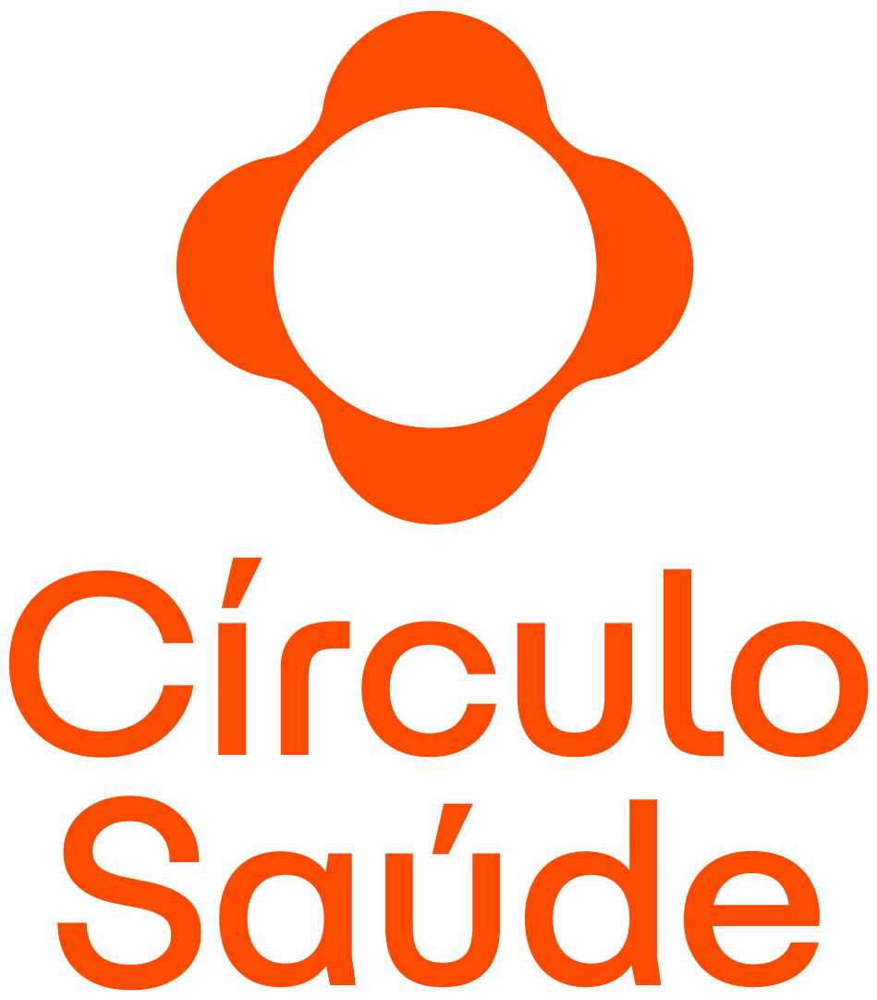

# 🩺 Círculo Saúde App

Aplicativo mobile oficial (conceito) inspirado na plataforma [**Círculo Saúde**](https://circulosaude.com.br/), desenvolvido em **Flutter** com o objetivo de oferecer uma experiência moderna, intuitiva e integrada aos beneficiários.

---

## 📱 Sobre o Projeto

O **Círculo Saúde App** foi idealizado para centralizar informações e serviços essenciais para os usuários da rede Círculo, permitindo fácil acesso à **carteirinha digital**, **agendamentos**, **guia médico**, **perfil do beneficiário**, entre outros.

> 🔸 *Este projeto é uma versão demonstrativa sem integração com backend (por enquanto).*

---

## 🎨 Identidade Visual

O design segue o padrão institucional da marca, com foco em **simplicidade, acessibilidade e confiança**.

| Elemento | Cor | Código |
|-----------|------|--------|
| Laranja Círculo | 🟧 | `#F7941D` |
| Azul Círculo | 🟦 | `#20409A` |
| Branco | ⚪ | `#FFFFFF` |

<p align="center">
  
</p>

---

## 🧭 Funcionalidades

### ✅ Versão atual (demo)
- **Splash Screen** com logo institucional  
- **Tela de Login** (mock)  
- **Home** com atalhos rápidos (grid)  
- **Carteirinha Digital** com visual moderno e código de barras  
- **Guia Médico** com busca local simulada  
- **Agendamentos** listando consultas/exames mockados  
- **Perfil** com informações básicas e opções de configuração  

---

## 🧱 Estrutura do Projeto

```bash
lib/
├── main.dart
├── app.dart
├── theme/
│   └── app_theme.dart
├── routes/
│   └── app_routes.dart
├── screens/
│   ├── splash_screen.dart
│   ├── login_screen.dart
│   ├── home_screen.dart
│   ├── carteirinha_screen.dart
│   ├── guia_medico_screen.dart
│   ├── agendamentos_screen.dart
│   └── perfil_screen.dart
└── widgets/
    ├── primary_button.dart
    ├── home_quick_action.dart
    └── carteirinha_card.dart
